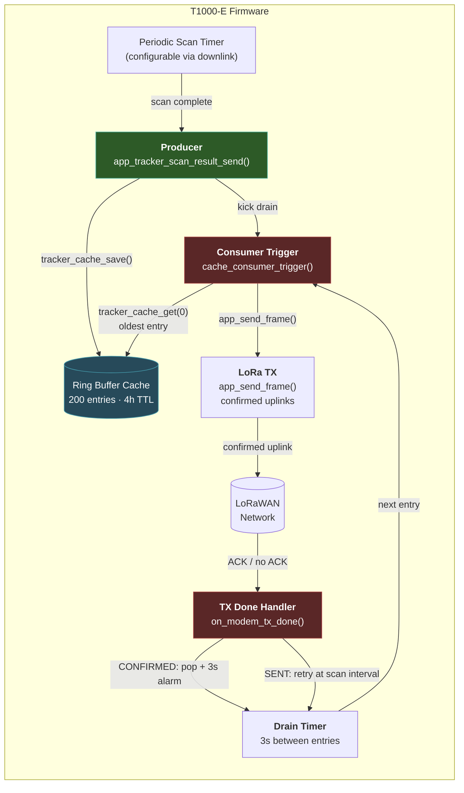
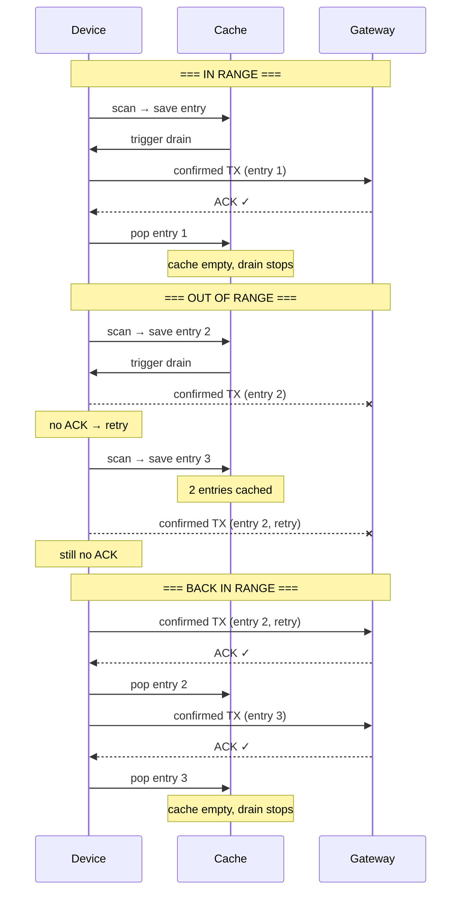

# T1000-E Tracker Firmware — v21 Cache Edition

Built: 2026-07-19
Device: [Seeed SenseCAP Card Tracker T1000-E for LoRaWAN](https://www.seeedstudio.com/SenseCAP-Card-Tracker-T1000-E-for-LoRaWAN-p-6408.html?srsltid=AfmBOoqFlj0sVbadGcyUSr_rvJ528UYaUHDS0Be087KTa7Tn1kPZtYKe&sensecap_affiliate=agiE1S0&referring_service=link) (nRF52840 + LR1110)
Based on: [Seeed-Studio/Seeed-Tracker-T1000-E-for-LoRaWAN-dev-board](https://github.com/Seeed-Studio/Seeed-Tracker-T1000-E-for-LoRaWAN-dev-board) (commit `f3ad9d4`)

## ⚠️ Before You Flash — Backup Your Factory Firmware

**This is permanent.** Once flashed, the factory firmware on your device is overwritten. Before proceeding:

1. Connect your T1000-E via USB-C
2. Double-press the button rapidly to enter UF2 bootloader mode (device appears as a USB drive)
3. Copy the file named `CURRENT.UF2` from the drive to your computer
4. Rename it to something descriptive like `FACTORY_T1000E_BACKUP.uf2`
5. Store it somewhere safe — this is your only path back to factory firmware

You can restore factory firmware at any time by dragging the backup UF2 back onto the device in bootloader mode.

## Architecture



### Producer / Consumer Pattern

The firmware uses a strict producer/consumer design with a single rule: **only the consumer calls `app_send_frame()` for sensor data.**

**Producer** (`app_tracker_scan_result_send`):
- Fires on every periodic scan (configurable interval)
- Collects GPS, WiFi, BLE, temperature, light, battery, accelerometer
- Builds the LoRaWAN payload with `beef` signature
- Calls `tracker_cache_save()` — saves to ring buffer unconditionally
- Calls `cache_consumer_trigger()` — wakes up the consumer if asleep
- **Never** calls `app_send_frame()` directly

**Consumer** (`cache_consumer_trigger` + `on_modem_tx_done`):
- The **only** code path that calls `app_send_frame()` for sensor uplinks
- Pulls from cache FIFO (`tracker_cache_get(0)` = oldest entry)
- Sends **confirmed** uplinks — only pops entries when network ACKs
- On TXDONE_CONFIRMED: pop entry → 3s drain timer → send next
- On TXDONE_SENT (transmitted but no ACK): retry at scan interval, entry stays cached
- On TXDONE_NOT_SENT (blocked by duty cycle): same retry behavior

**Key invariant:** Sensor data flows `scan → cache → drain → TX → ACK → pop`. No shortcuts.

### Cache Details

| Property | Value |
|----------|-------|
| Capacity | 200 entries |
| Entry size | Up to 128 bytes (max LoRaWAN payload) |
| TTL | 4 hours (older entries skipped on replay) |
| Overflow | FIFO — oldest overwritten when full |
| Drain speed | 3 seconds between entries (fast flush when back in range) |
| Retry interval | Matches scan interval (no extra battery drain vs factory) |
| Delivery guarantee | Confirmed uplinks — ACK required before pop |

### Cache Flow: Offline → Online



## Downlink Configuration

Change scan interval by sending a downlink on **FPort 5**:

| Interval | Downlink Hex | Notes |
|----------|-------------|-------|
| 2 minutes | `81 00 00 00 02` | Default factory |
| 5 minutes | `81 00 00 00 05` | |
| 10 minutes | `81 00 00 00 0A` | |
| 15 minutes | `81 00 00 00 0F` | |
| 30 minutes | `81 00 00 00 1E` | |
| 60 minutes | `81 00 00 00 3C` | |

**Format:** `81 00 00 HH LL`
- `81` = downlink command: set periodic interval
- `00 00` = reserved
- `HH LL` = interval in **minutes**, **big-endian** (memcpyr reversal)
  - 2 min = `0x0002` → bytes `00 02`
  - 5 min = `0x0005` → bytes `00 05`
  - 60 min = `0x003C` → bytes `00 3C`

**How to send** via ChirpStack:
1. Go to Device → Queue
2. FPort: `5`
3. Hex payload: `8100000005` (for 5 minutes)
4. Click Enqueue

The device applies the new interval on next scan cycle. The change persists across reboots.

## Version Identification

Power-on uplink (FPort 5) ends in `XX c0 de` where XX is the firmware version:

| Version | Power-on payload ending |
|---------|------------------------|
| v20 | `...14 c0 de` |
| v21 | `...15 c0 de` |
| v22 (future) | `...16 c0 de` |

All sensor uplinks end in `be ef`.

## Prerequisites to Build

1. **nRF5 SDK 17.1.0** at `C:\nRF5_SDK_17.1.0_ddde560`
   - Must include SoftDevice s140 7.2.0
   - Must include the Seeed T1000-E project under `examples/ble_peripheral/t1000-e/`
   - Must include `modules/nrfx/mdk/gcc_startup_nrf52840.S`

2. **PlatformIO ARM GCC toolchain** at `C:\Users\<user>\.platformio\packages\toolchain-gccarmnoneeabi\`
   - GCC 12.3.1 (`arm-none-eabi-gcc`)
   - Install: `pio platform install nordicnrf52`

3. **Python 3** (stdlib only, no extra packages)

4. **uf2conv.py** from [Microsoft UF2 tools](https://github.com/microsoft/uf2) — placed at `C:\Users\<user>\uf2conv.py`

5. **CH340 USB driver** — required for UF2 bootloader mode on Windows

## Source Files

| File | Role |
|------|------|
| `apps/examples/11_lorawan_tracker/main_lorawan_tracker.c` | Main firmware: producer/consumer logic, cache drain, TX handlers |
| `apps/examples/11_lorawan_tracker/main_lorawan_tracker.h` | Header: app_send_frame declaration |
| `t1000_e/tracker/inc/app_tracker_cache.h` | Cache engine header: ring buffer API, config constants |
| `t1000_e/tracker/src/app_tracker_cache.c` | Cache engine: ring buffer implementation |
| `t1000_e/tracker/src/app_lora_packet.c` | Power-on uplink, downlink decode, version byte |
| `pca10056/11_ses_lorawan_tracker/build_factory.py` | GCC build script (NEW — not in Seeed repo) |
| `pca10056/t1000_e_dev_kit_pca10056.ld` | GCC linker script (replaces SES's thumb_crt0.s) |

## How to Build

```bash
cd C:\nRF5_SDK_17.1.0_ddde560\examples\ble_peripheral\t1000-e\pca10056\s140\11_ses_lorawan_tracker
python3 build_factory.py
```

Output in `Output/Debug/Exe/`:
- `t1000_e_dev_kit_pca10056.elf` — compiled firmware
- `t1000-e-vXX.uf2` — **DO NOT USE** (wrong family ID)

### Creating a Flashable UF2

The build script produces a UF2 with family `0xADA52840` (standard nRF52840). The T1000-E bootloader requires **`0x28860057`**. Fix it:

```bash
UF2CONV="C:/Users/<user>/uf2conv.py"
SD_HEX="C:/nRF5_SDK_17.1.0_ddde560/components/softdevice/s140/hex/s140_nrf52_7.2.0_softdevice.hex"
EXE="Output/Debug/Exe"

# Rebuild SD + App UF2s with T1000-E family
python3 "$UF2CONV" -f 0x28860057 -b 0x0000 -c -o "$EXE/sd.uf2" "$SD_HEX"
python3 "$UF2CONV" -f 0x28860057 -b 0x27000 -c -o "$EXE/app.uf2" "$EXE/t1000_e_dev_kit_pca10056.hex"

# Concatenate, strip MBR blocks, fix sequence numbers
python3 -c "
import struct
sd = open('$EXE/sd.uf2','rb').read()
ap = open('$EXE/app.uf2','rb').read()
c = sd + ap
v = [c[b*512:(b+1)*512] for b in range(len(c)//512)
     if struct.unpack('<I',c[b*512:b*512+4])[0]==0x0A324655
     and struct.unpack('<I',c[b*512+4:b*512+8])[0]==0x9E5D5157
     and struct.unpack('<I',c[b*512+12:b*512+16])[0]>=0x1000]
t = len(v); o = bytearray()
for i,b in enumerate(v):
    bb = bytearray(b)
    struct.pack_into('<II',bb,20,i,t)
    o.extend(bb)
open('t1000-e-vXX-cache.uf2','wb').write(o)
print(f'Done: {len(o)} bytes, {t} blocks')
"
```

### Flashing

1. Connect T1000-E via USB-C
2. Double-press the button rapidly — device enters UF2 bootloader mode (appears as USB drive)
3. Drag the flashable UF2 onto the drive
4. Device reboots automatically

## Key Design Decisions

| Decision | Why |
|----------|-----|
| **GCC not SES** | SEGGER Embedded Studio can't compile this project (missing startup files, GCC 15 too strict). Use PlatformIO's arm-none-eabi-gcc 12.3.1. |
| **gcc_startup_nrf52840.S** | SES's `thumb_crt0.s` is SEGGER-specific. nRF5 SDK's GCC startup provides the correct vector table. |
| **UF2 family 0x28860057** | T1000-E bootloader requires this. Standard nRF52840 family (0xADA52840) is silently rejected. |
| **No MBR blocks** | UF2 blocks at 0x0-0xFFF cause bootloader rejection. Must strip before flashing. |
| **Confirmed drain** | Unconfirmed drain lost entries (SENT → popped without arrival). Confirmed uplinks with ACK-based pop are correct. |
| **Timer-based cascade** | Calling `app_send_frame()` from inside `on_modem_tx_done()` is not re-entrant safe. Use 3s drain timer instead of callback cascade. |
| **Retry = scan interval** | 30s retry burned battery for no benefit. Matching retry to scan interval adds zero extra TXs vs factory firmware. |

## Pitfalls

- **Build cache**: If `FIRMWARE_VERSION` changes but binary doesn't update, delete `Output/Debug/Obj/` and rebuild.
- **Timer callbacks**: Must have signature `void handler(void *p_context)`, NOT `void handler(void)` — stack corruption otherwise.
- **Escape sequences**: The patch tool double-escapes `\n` → `\\n` in C string literals. Verify after patching.
- **UF2 address offset**: The `TargetAddr` field is at byte offset 12 in the UF2 block header, not 8 (which is `Flags`).
- **memcpyr reversal**: All multi-byte fields in downlinks use `memcpyr` (big-endian reversal). `0x0005` → bytes `00 05` not `05 00`.
