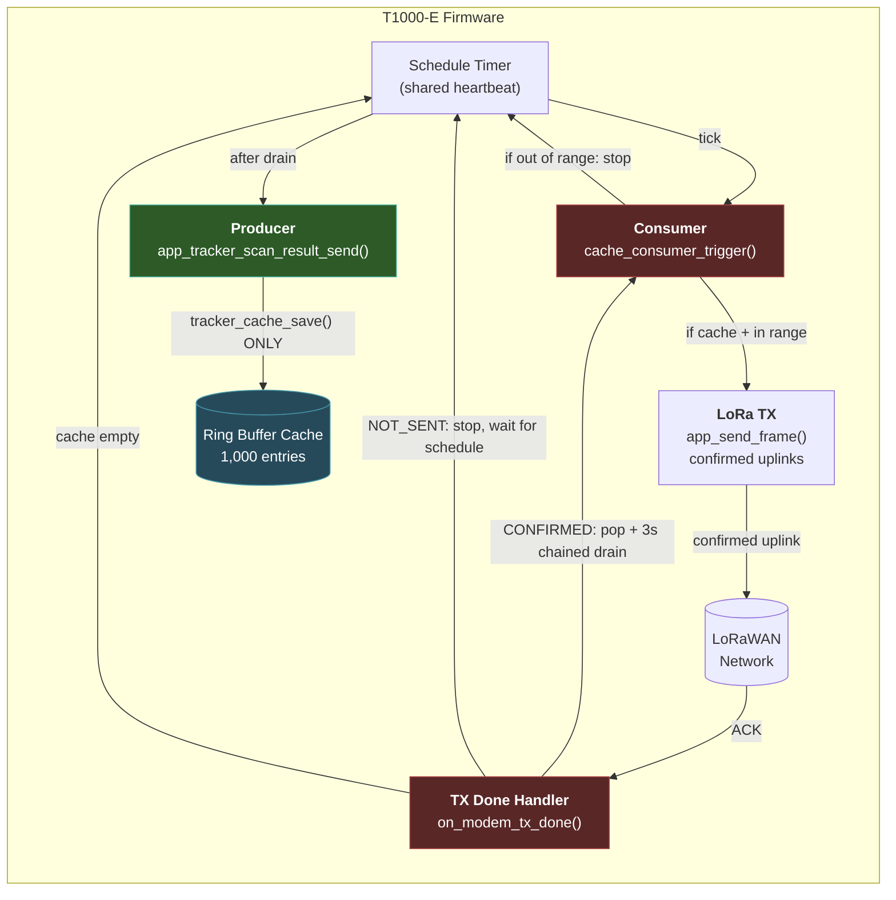
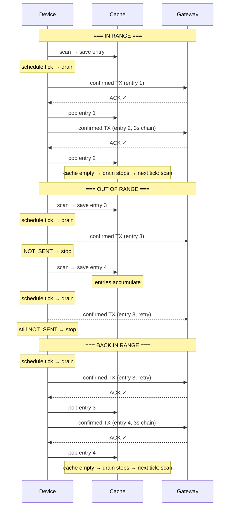

# T1000-E Tracker Firmware — v24 Producer/Consumer Edition

Built: 2026-08-09
Device: [Seeed SenseCAP Card Tracker T1000-E for LoRaWAN](https://www.seeedstudio.com/SenseCAP-Card-Tracker-T1000-E-for-LoRaWAN-p-6408.html?srsltid=AfmBOoqFlj0sVbadGcyUSr_rvJ528UYaUHDS0Be087KTa7Tn1kPZtYKe&sensecap_affiliate=agiE1S0&referring_service=link) (nRF52840 + LR1110)
Based on: [Seeed-Studio/Seeed-Tracker-T1000-E-for-LoRaWAN-dev-board](https://github.com/Seeed-Studio/Seeed-Tracker-T1000-E-for-LoRaWAN-dev-board) (commit `f3ad9d4`)

> **v24 is a complete architectural rewrite.** Producer and consumer are fully separated — the producer only writes to cache, the consumer drains independently on schedule. Fast-drain burst when in range, stops when out of range. User/turbo scans queue behind the drain.

## 📖 Read the Full Article

Detailed write-up with architecture diagrams, field test results, and flashing guide:  
**[T1000-E Cache Firmware: Never Lose LoRaWAN Sensor Data Again](https://hub.lorameshdevices.com/projects/t1000-e-cache-firmware-never-lose-lorawan-sensor-data-again)** — published on LoRa Mesh Devices

## ⚠️ Before You Flash — Backup Your Factory Firmware

**This is permanent.** Once flashed, the factory firmware on your device is overwritten. Before proceeding:

1. Connect your T1000-E via USB-C
2. Double-press the button rapidly to enter UF2 bootloader mode (device appears as a USB drive)
3. Copy the file named `CURRENT.UF2` from the drive to your computer
4. Rename it to something descriptive like `FACTORY_T1000E_BACKUP.uf2`
5. Store it somewhere safe — this is your only path back to factory firmware

You can restore factory firmware at any time by dragging the backup UF2 back onto the device in bootloader mode.

## v24 Button Behavior

The button controls are redesigned for v24. SOS mode is removed. All data flows through the cache with strict producer/consumer separation.

| Press | Action | Beep Feedback |
|-------|--------|---------------|
| **Single-press** | Trigger immediate scan | **Short ack beep** on press (~40ms) · After 45s scan: 3 short beeps = GPS fix, 2 long beeps = no fix |
| **Double-press** | Toggle **turbo mode** | 500ms long beep on enter, 500ms long beep on exit |
| **Triple-press** | BLE advertising (unchanged) | — |
| **Quad-press** | **Force drain cache** | 500ms long beep on start, 500ms long beep when drain completes |
| **Long-press** (3s) | Power off (unchanged) | Power-off melody |

### Single-Press Flow
1. Button press → **immediate 40ms ack beep**
2. ~45s GNSS scan with timeout
3. Data saved to cache
4. 3 short beeps (GPS fix) or 2 long beeps (no fix)
5. If drain is active: scan queues, runs after drain completes
6. Multiple presses during scan: queued and processed sequentially

### Turbo Mode
- Scans every **~1 minute** (instead of your configured interval)
- Beeps **once** after each scan completes
- Data is cached and drains on schedule — same as normal mode
- **Paused during drain** — resumes after cache is empty
- Double-press again to exit turbo and restore the previous interval

### Force Drain (Quad-Press)
- Press 4× rapidly → 500ms beep (start) → consumer fast-drains all cached entries
- In range: entries drain at 3s intervals via confirmed uplinks
- Out of range: one attempt, then stops
- Cache empty → 500ms beep (finish)
- Useful for flushing cached data immediately when back in range

### Motion Gate (v23)

When the device has a GPS fix, it compares the current position to the last saved position. If the device hasn't moved more than **25 meters**, the scan result is **not saved to cache and no LoRa TX is sent**. This saves battery and airtime when the device is stationary.

**Always saved regardless of movement:**
- User-triggered scans (single-press button)
- First GPS fix after power-on
- WiFi-only and BLE-only scans (no GPS data to compare)

The GPS scan itself still runs — beep feedback continues to indicate fix/no-fix. Only the data path is gated.

> **Note:** No GPS = can't determine movement = always save. If you're indoors or in GPS-denied conditions, every scan will be cached regardless of whether the device actually moved.

### Heartbeat (v23)

To prevent the device from going completely silent when stationary, a **1-hour heartbeat** ensures at least one position is transmitted every hour — even if you haven't moved. This keeps the map alive and proves the device is still working.

## Architecture (v24)


```mermaid
flowchart TD
    subgraph Device["T1000-E Firmware"]
        direction TB
        SCHEDULE["Schedule Timer<br/>(shared heartbeat)"]
        PRODUCER["<b>Producer</b><br/>app_tracker_scan_result_send()"]
        CACHE[("Ring Buffer Cache<br/>1,000 entries")]
        CONSUMER["<b>Consumer</b><br/>cache_consumer_trigger()"]
        TX["<b>LoRa TX</b><br/>app_send_frame()<br/>confirmed uplinks"]
        TXDONE["<b>TX Done Handler</b><br/>on_modem_tx_done()"]
        LORA[("LoRaWAN<br/>Network")]
    end

    SCHEDULE -->|"tick"| CONSUMER
    CONSUMER -->|"if cache + in range"| TX
    CONSUMER -->|"if out of range: stop"| SCHEDULE
    TX -->|"confirmed uplink"| LORA
    LORA -->|"ACK"| TXDONE
    TXDONE -->|"CONFIRMED: pop + 3s chained drain"| CONSUMER
    TXDONE -->|"NOT_SENT: stop, wait for schedule"| SCHEDULE
    TXDONE -->|"cache empty"| SCHEDULE
    SCHEDULE -->|"after drain"| PRODUCER
    PRODUCER -->|"tracker_cache_save() ONLY"| CACHE

    style PRODUCER fill:#2d5a27,stroke:#4a9,color:#fff
    style CONSUMER fill:#5a2727,stroke:#a44,color:#fff
    style TXDONE fill:#5a2727,stroke:#a44,color:#fff
    style CACHE fill:#274a5a,stroke:#49a,color:#fff
```

### Producer / Consumer Separation (v24)

The firmware enforces strict separation with a single rule: **only the consumer calls `app_send_frame()` for sensor data. The producer only writes to cache.**

**Producer** (`app_tracker_scan_result_send`):
- Fires on schedule OR user single-press OR turbo double-press
- Collects GPS, temperature, light, battery, accelerometer
- Builds payload with GPS epoch timestamp + `beef` signature
- Calls `tracker_cache_save()` — writes to ring buffer
- **Never** calls `app_send_frame()` or `cache_consumer_trigger()`

**Consumer** (`cache_consumer_trigger` + `on_modem_tx_done`):
- The **only** code path that calls `app_send_frame()` for sensor uplinks
- Runs on the shared schedule tick
- Pulls from cache FIFO (`tracker_cache_get(0)` = oldest entry)
- Sends **confirmed** uplinks — only pops entries when network ACKs
- **In range (CONFIRMED):** pops entry → 3s chain → fast-drains ALL remaining entries
- **Out of range (NOT_SENT):** stops immediately — waits for next schedule tick
- When cache empty: next schedule tick runs the producer for a new scan

**Mutual exclusion:** While the consumer is draining (`cache_drain_active = true`), the producer is blocked. User and turbo scans queue behind the drain — they run automatically once the cache is empty.

### Cache Details

| Property | Value |
|----------|-------|
| Capacity | 1,000 entries |
| Entry size | 136 bytes (128 data + 8 metadata) |
| RAM used | ~136 KB |
| TTL | None — all entries replayed |
| Storage at 5-min scan | ~83 hours (~3.5 days) |
| Storage at 1-min turbo | ~16 hours |
| Overflow | FIFO — oldest overwritten when full |
| Drain speed (in range) | 3 seconds between entries (fast burst) |
| Drain speed (out of range) | One attempt per schedule tick, then stops |
| Delivery guarantee | Confirmed uplinks — ACK required before pop |

### Cache Flow: Offline → Online


```mermaid
sequenceDiagram
    participant D as Device
    participant C as Cache
    participant G as Gateway

    Note over D,G: === IN RANGE ===
    D->>C: scan → save entry
    Note over D: schedule tick → drain
    D->>G: confirmed TX (entry 1)
    G-->>D: ACK ✓
    D->>C: pop entry 1
    D->>G: confirmed TX (entry 2, 3s chain)
    G-->>D: ACK ✓
    D->>C: pop entry 2
    Note over C: cache empty → drain stops → next tick: scan

    Note over D,G: === OUT OF RANGE ===
    D->>C: scan → save entry 3
    Note over D: schedule tick → drain
    D--xG: confirmed TX (entry 3)
    Note over D: NOT_SENT → stop
    D->>C: scan → save entry 4
    Note over C: entries accumulate
    Note over D: schedule tick → drain
    D--xG: confirmed TX (entry 3, retry)
    Note over D: still NOT_SENT → stop

    Note over D,G: === BACK IN RANGE ===
    Note over D: schedule tick → drain
    D->>G: confirmed TX (entry 3, retry)
    G-->>D: ACK ✓
    D->>C: pop entry 3
    D->>G: confirmed TX (entry 4, 3s chain)
    G-->>D: ACK ✓
    D->>C: pop entry 4
    Note over C: cache empty → drain stops → next tick: scan
```

## Downlink Configuration

Change scan interval by sending a downlink on **FPort 5**:

| Interval | Downlink Hex | Notes |
|----------|-------------|-------|
| 2 minutes | `81 00 00 00 02` | Default factory |
| 5 minutes | `81 00 00 00 05` | |
| 10 minutes | `81 00 00 00 0A` | |
| 15 minutes | `81 00 00 00 0F` | |
| 30 minutes | `81 00 00 00 1E` | |
| 60 minutes | `81 00 00 00 3C` | |

**Format:** `81 00 00 HH LL`
- `81` = downlink command: set periodic interval
- `00 00` = reserved
- `HH LL` = interval in **minutes**, **big-endian** (memcpyr reversal)
  - 2 min = `0x0002` → bytes `00 02`
  - 5 min = `0x0005` → bytes `00 05`
  - 60 min = `0x003C` → bytes `00 3C`

**How to send** via ChirpStack:
1. Go to Device → Queue
2. FPort: `5`
3. Hex payload: `8100000005` (for 5 minutes)
4. Click Enqueue

The device applies the new interval on next scan cycle. The change persists across reboots.

## Version Identification

Power-on uplink (FPort 5) ends in `XX c0 de` where XX is the firmware version:

| Version | Power-on payload ending |
|---------|------------------------|
| v20 | `...14 c0 de` |
| v21 | `...15 c0 de` |
| v22 | `...16 c0 de` |
| v23 | `...17 c0 de` |
| v24 | `...18 c0 de` |

All sensor uplinks end in `be ef`.

## Prerequisites to Build

1. **nRF5 SDK 17.1.0** at `C:\nRF5_SDK_17.1.0_ddde560`
   - Must include SoftDevice s140 7.2.0
   - Must include the Seeed T1000-E project under `examples/ble_peripheral/t1000-e/`
   - Must include `modules/nrfx/mdk/gcc_startup_nrf52840.S`

2. **PlatformIO ARM GCC toolchain** at `C:\Users\<user>\.platformio\packages\toolchain-gccarmnoneeabi\`
   - GCC 12.3.1 (`arm-none-eabi-gcc`)
   - Install: `pio platform install nordicnrf52`

3. **Python 3** (stdlib only, no extra packages)

4. **uf2conv.py** from [Microsoft UF2 tools](https://github.com/microsoft/uf2) — placed at `C:\Users\<user>\uf2conv.py`

5. **CH340 USB driver** — required for UF2 bootloader mode on Windows

## Source Files

| File | Role |
|------|------|
| `apps/examples/11_lorawan_tracker/main_lorawan_tracker.c` | Main firmware: producer/consumer logic, cache drain, TX handlers |
| `apps/examples/11_lorawan_tracker/main_lorawan_tracker.h` | Header: app_send_frame declaration |
| `t1000_e/tracker/inc/app_tracker_cache.h` | Cache engine header: ring buffer API, config constants |
| `t1000_e/tracker/src/app_tracker_cache.c` | Cache engine: ring buffer implementation |
| `t1000_e/tracker/src/app_lora_packet.c` | Power-on uplink, downlink decode, version byte |
| `pca10056/11_ses_lorawan_tracker/build_factory.py` | GCC build script (NEW — not in Seeed repo) |
| `pca10056/t1000_e_dev_kit_pca10056.ld` | GCC linker script (replaces SES's thumb_crt0.s) |

## How to Build

```bash
cd C:\nRF5_SDK_17.1.0_ddde560\examples\ble_peripheral\t1000-e\pca10056\s140\11_ses_lorawan_tracker
python3 build_factory.py
```

Output in `Output/Debug/Exe/`:
- `t1000_e_dev_kit_pca10056.elf` — compiled firmware
- `t1000-e-vXX.uf2` — **DO NOT USE** (wrong family ID)

### Creating a Flashable UF2

The build script produces a UF2 with family `0xADA52840` (standard nRF52840). The T1000-E bootloader requires **`0x28860057`**. Fix it:

```bash
UF2CONV="C:/Users/<user>/uf2conv.py"
SD_HEX="C:/nRF5_SDK_17.1.0_ddde560/components/softdevice/s140/hex/s140_nrf52_7.2.0_softdevice.hex"
EXE="Output/Debug/Exe"

# Rebuild SD + App UF2s with T1000-E family
python3 "$UF2CONV" -f 0x28860057 -b 0x0000 -c -o "$EXE/sd.uf2" "$SD_HEX"
python3 "$UF2CONV" -f 0x28860057 -b 0x27000 -c -o "$EXE/app.uf2" "$EXE/t1000_e_dev_kit_pca10056.hex"

# Concatenate, strip MBR blocks, fix sequence numbers
python3 -c "
import struct
sd = open('$EXE/sd.uf2','rb').read()
ap = open('$EXE/app.uf2','rb').read()
c = sd + ap
v = [c[b*512:(b+1)*512] for b in range(len(c)//512)
     if struct.unpack('<I',c[b*512:b*512+4])[0]==0x0A324655
     and struct.unpack('<I',c[b*512+4:b*512+8])[0]==0x9E5D5157
     and struct.unpack('<I',c[b*512+12:b*512+16])[0]>=0x1000]
t = len(v); o = bytearray()
for i,b in enumerate(v):
    bb = bytearray(b)
    struct.pack_into('<II',bb,20,i,t)
    o.extend(bb)
open('t1000-e-vXX-cache.uf2','wb').write(o)
print(f'Done: {len(o)} bytes, {t} blocks')
"
```

### Flashing

1. Connect T1000-E via USB-C
2. Double-press the button rapidly — device enters UF2 bootloader mode (appears as USB drive)
3. Drag the flashable UF2 onto the drive
4. Device reboots automatically

## Key Design Decisions

| Decision | Why |
|----------|-----|
| **GCC not SES** | SEGGER Embedded Studio can't compile this project (missing startup files, GCC 15 too strict). Use PlatformIO's arm-none-eabi-gcc 12.3.1. |
| **gcc_startup_nrf52840.S** | SES's `thumb_crt0.s` is SEGGER-specific. nRF5 SDK's GCC startup provides the correct vector table. |
| **UF2 family 0x28860057** | T1000-E bootloader requires this. Standard nRF52840 family (0xADA52840) is silently rejected. |
| **No MBR blocks** | UF2 blocks at 0x0-0xFFF cause bootloader rejection. Must strip before flashing. |
| **Producer/consumer separation** | Producer only calls `tracker_cache_save()`. Consumer is the ONLY path for `app_send_frame()`. No shortcuts. |
| **Hybrid drain** | In range: fast-drain all entries at 3s intervals. Out of range: one attempt, then stop — wait for next schedule. Same behavior in-range or out-of-range — no special offline mode. |
| **Mutual exclusion** | Consumer blocks producer via `cache_drain_active`. User/turbo scans queue behind drain. |
| **Confirmed drain** | Only pop cache entries on CONFIRMED ACK. SENT/NOT_SENT keep entry in cache for next retry. |
| **GPS epoch in payload** | 4 bytes of GPS epoch time embedded in every v24 payload. Positions retain original timestamps through offline cache replay. |

## Pitfalls

- **Build cache**: If `FIRMWARE_VERSION` changes but binary doesn't update, delete `Output/Debug/Obj/` and rebuild.
- **Timer callbacks**: Must have signature `void handler(void *p_context)`, NOT `void handler(void)` — stack corruption otherwise.
- **Escape sequences**: The patch tool double-escapes `\n` → `\\n` in C string literals. Verify after patching.
- **UF2 address offset**: The `TargetAddr` field is at byte offset 12 in the UF2 block header, not 8 (which is `Flags`).
- **memcpyr reversal**: All multi-byte fields in downlinks use `memcpyr` (big-endian reversal). `0x0005` → bytes `00 05` not `05 00`.

## License

The cache engine (`app_tracker_cache.h/.c`), build script (`build_factory.py`), and all modifications to Seeed's firmware are copyright (C) 2026 ViVSoft Computers LLC and licensed under the [GNU Affero General Public License v3.0](LICENSE).

The original Seeed tracker firmware is [MIT licensed](README-Seeed.md). The LoRa Basics Modem is [Clear BSD](lora_basics_modem/LICENSE) licensed by Semtech. The nRF5 SDK and SoftDevice are licensed by Nordic Semiconductor.
