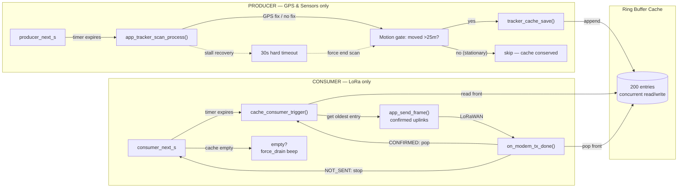

# T1000-E Tracker Firmware — v25 Independent Producer/Consumer Edition

Built: 2026-08-11  
Device: [Seeed SenseCAP Card Tracker T1000-E for LoRaWAN](https://www.seeedstudio.com/SenseCAP-Card-Tracker-T1000-E-for-LoRaWAN-p-6408.html) (nRF52840 + LR1110)  
Based on: [Seeed-Studio/Seeed-Tracker-T1000-E-for-LoRaWAN-dev-board](https://github.com/Seeed-Studio/Seeed-Tracker-T1000-E-for-LoRaWAN-dev-board) (commit `f3ad9d4`)

> **v25 is a complete architectural rewrite.** Producer and consumer are fully independent — each has its own timer, own schedule, own watchdog. They share nothing except the ring buffer cache. Producer only touches GPS/sensors and writes to cache. Consumer only touches the LoRa radio and reads from cache. Neither blocks the other.

## 📖 Read the Full Article

Detailed write-up with architecture diagrams, field test results, and flashing guide:  
**[T1000-E Cache Firmware: Never Lose LoRaWAN Sensor Data Again](https://hub.lorameshdevices.com/projects/t1000-e-cache-firmware-never-lose-lorawan-sensor-data-again)** — LoRa Mesh Devices

## ⚠️ Before You Flash — Backup Your Factory Firmware

**This is permanent.** Once flashed, the factory firmware is overwritten.

1. Connect your T1000-E via USB-C
2. Double-press the button rapidly to enter UF2 bootloader mode (device appears as a USB drive)
3. Copy `CURRENT.UF2` from the drive to your computer
4. Rename it to `FACTORY_T1000E_BACKUP.uf2` and store it somewhere safe
5. To restore: drag the backup UF2 onto the device in bootloader mode

## Flash

1. Double-press the button to enter UF2 bootloader
2. Drag `t1000-e-v25.uf2` onto the USB drive
3. Device reboots automatically after flashing (~10 seconds)

## v25 Button Behavior

| Press | Action | Beep Feedback |
|-------|--------|---------------|
| **Single-press** | Trigger immediate scan (15s, 30s hard timeout) | Short ack beep on press (~40ms) · After scan: 3 short = GPS fix, 2 long = no fix |
| **Double-press** | Toggle **turbo mode** (~1min scans) | 500ms long beep on enter · 500ms long beep on exit |
| **Triple-press** | BLE advertising | — |
| **Quad-press** | **Force drain all cached entries** | 500ms long beep on start · 500ms long beep when complete |
| **Long-press** (3s) | Power off | Power-off melody |

### Single-Press Flow
1. Button press → immediate 40ms ack beep
2. 15s GNSS scan (30s hard timeout if alarm stalls)
3. Data saved to cache (never blocks if drain is running — producer is independent)
4. 3 short beeps (GPS fix) or 2 long beeps (no fix)
5. Additional presses while scanning: silently ignored (no queue)

### GPS Scan Timeout
- GNSS scan duration: **15 seconds** (typical)
- **30-second hard timeout**: if the modem alarm system stalls, `scan_process` checks elapsed time at every alarm tick and force-terminates the scan at 30s regardless
- This prevents single-click scans from running indefinitely when GPS can't get a fix

### Turbo Mode
- Scans every **~1 minute** (independent of consumer drain interval)
- Beeps **once** after each scan completes
- Data is cached — consumer drains on its **own 25-minute schedule**
- Turbo scan entries always save (motion gate bypassed — turbo is an explicit user action)
- Double-press again to exit and restore previous scan interval

### Force Drain (Quad-Press)
- Press 4× rapidly → 500ms beep (start) → consumer fast-drains all cached entries
- In range: entries drain at 3s intervals via confirmed uplinks
- Out of range: one attempt, then stops
- Cache empty → 500ms beep (finish) — works immediately even with no entries
- Useful for flushing cached data immediately

### Motion Gate (25m)
Pure motion gate — only cache entries when the device actually moves.

| Condition | Saves to cache? |
|---|---|
| **Moved >25m** (GPS jitter compared to last saved position) | ✅ Yes |
| **Stationary** (GPS fix within 25m of last position) | ❌ No — cache stays empty, consumer finds nothing to drain |
| **No GPS fix** (can't determine if moved) | ✅ Yes — can't gate what you can't measure |
| **User press** (single-click) | ✅ Yes — always saves |
| **Turbo active** (double-click) | ✅ Yes — always saves |
| **First GPS fix after power-on** | ✅ Yes — establishes baseline |

Result: stationary device → empty cache → consumer fires on schedule, finds nothing, waits. Battery and airtime conserved.

## Architecture (v25)

### Core Principle: Complete Separation

Producer and consumer share **nothing** except the ring buffer cache. Each has:
- Its own timer (`producer_next_s` / `consumer_next_s`)
- Its own watchdog
- Its own schedule function (`schedule_producer()` / `schedule_consumer()`)
- Its own state (scan state machine / drain state machine)

```
┌─────────────────────────────────────────────────────────────────┐
│                       on_modem_alarm()                          │
│                                                                 │
│  ┌─ if now >= consumer_next_s:                                 │
│  │    ┌─ cache has entries + drain idle → drain one entry      │
│  │    ├─ cache empty + force_drain → beep finish immediately   │
│  │    ├─ cache empty → schedule_consumer(drain_interval=1500s) │
│  │    └─ drain active → watch for 60s timeout → schedule(3s)   │
│  │                                                              │
│  └─ if now >= producer_next_s:                                  │
│       └─ app_tracker_scan_process() → GPS → save to cache      │
│           30s hard timeout if scan stalls                        │
│                                                                 │
│  sync_alarm() → min(producer_next, consumer_next) → modem alarm│
└─────────────────────────────────────────────────────────────────┘
```


```mermaid
flowchart LR
    subgraph PRODUCER["PRODUCER — GPS & Sensors only"]
        P_TIMER["producer_next_s"]
        SCAN["app_tracker_scan_process()"]
        SAVE["tracker_cache_save()"]
        GATE["Motion gate: moved >25m?"]
        TIMEOUT["30s hard timeout"]
        P_TIMER -->|"timer expires"| SCAN
        SCAN -->|"GPS fix / no fix"| GATE
        GATE -->|"yes"| SAVE
        GATE -->|"no (stationary)"| SKIP["skip — cache conserved"]
        SCAN -.->|"stall recovery"| TIMEOUT
        TIMEOUT -.->|"force end scan"| GATE
    end

    subgraph CACHE["Ring Buffer Cache"]
        RB[("200 entries<br/>concurrent read/write")]
    end

    subgraph CONSUMER["CONSUMER — LoRa only"]
        C_TIMER["consumer_next_s"]
        DRAIN["cache_consumer_trigger()"]
        TX["app_send_frame()<br/>confirmed uplinks"]
        TXDONE["on_modem_tx_done()"]
        EMPTY["empty?<br/>force_drain beep"]
        C_TIMER -->|"timer expires"| DRAIN
        DRAIN -->|"get oldest entry"| TX
        TX -->|"LoRaWAN"| TXDONE
        TXDONE -->|"CONFIRMED: pop"| DRAIN
        TXDONE -->|"NOT_SENT: stop"| C_TIMER
        C_TIMER -->|"cache empty"| EMPTY
    end

    SAVE -->|"append"| RB
    DRAIN -->|"read front"| RB
    TXDONE -->|"pop front"| RB
```

### Timer Separation

| | Producer | Consumer |
|---|---|---|
| **Timer variable** | `producer_next_s` (absolute RTC) | `consumer_next_s` (absolute RTC) |
| **Schedule function** | `schedule_producer(delay)` | `schedule_consumer(delay)` |
| **Default interval** | 300s (5 min, configurable via downlink) | 1500s (25 min) |
| **Never touches** | `app_send_frame()` or LoRa | `tracker_cache_save()` or GPS/sensors |

`sync_alarm()` picks the sooner of the two timers for the single modem alarm — both fire independently.

### Watchdogs

| Watchdog | Side | Trigger | Action |
|---|---|---|---|
| **Scan stall** | Producer | Same scan status for 3 alarm ticks | Force-reset to idle |
| **GPS scan timeout** | Producer | GPS scan running > 30s | Force `gnss_scan_end()` and advance state |
| **Drain TX timeout** | Consumer | `cache_drain_active` stays true > 60s | Force-reset and reschedule |
| **send_frame failure** | Consumer | `app_send_frame()` returns false | Immediate drain reset |

### Drain Chain

When in LoRa range:
1. Consumer timer fires → drain one entry via confirmed uplink
2. `TXDONE_CONFIRMED` → pop entry → `schedule_consumer(3)` → 3s later drain next
3. Repeat until cache empty → `schedule_consumer(1500)` → wait 25 min for next schedule

When out of range:
1. TX fails with `NOT_SENT` → `cache_drain_active = false` → `schedule_consumer(1500)`
2. Next schedule tick retries

## Key Design Decisions

1. **Producer never calls `app_send_frame()`** — GPS/sensors only write to cache
2. **Consumer never calls `tracker_cache_save()`** — LoRa only reads/drains from cache
3. **Drain interval: 25 min** — consumer drains infrequently to save airtime; quad-press force-drains anytime
4. **Pure motion gate** — no heartbeat forcing saves when stationary; empty cache = nothing to drain
5. **Single-click: simple and fast** — 15s scan with 30s hard timeout, no queue, additional presses ignored while scanning
6. **Turbo always saves** — explicit user action bypasses motion gate
7. **Confirmed uplinks only** — cache entries popped only on real ACK, not on NOT_SENT
8. **No mutual exclusion** — producer and consumer run concurrently in `on_modem_alarm()`
9. **60s TX watchdog** — if modem never calls TX-done, consumer recovers automatically

## Configuring Scan Interval (Downlink)

Send a downlink on FPort 5 to change the periodic scan interval:

| Interval | Hex Payload |
|---|---|
| 2 min | `81 00 00 00 02` |
| 5 min | `81 00 00 00 05` |
| 10 min | `81 00 00 00 0A` |
| 15 min | `81 00 00 00 0F` |
| 30 min | `81 00 00 00 1E` |
| 60 min | `81 00 00 00 3C` |

**Format:** `81 00 00 HH LL` where HH LL = interval in minutes (big-endian).  
**How to send:** ChirpStack → Device → Queue → FPort 5 → Hex payload.  
The new interval takes effect on the next scan cycle.

## Cache

- Ring buffer, 200 entries maximum
- 4-hour TTL (entries older than 4 hours are expired)
- Concurrent read/write safe — producer appends at write pointer, consumer reads at read pointer
- All entries are confirmed uplinks — only popped on `TXDONE_CONFIRMED`

## Build

Requires nRF5 SDK 17.1.0 and ARM GCC toolchain.

```bash
cd examples/ble_peripheral/t1000-e/pca10056/s140/11_ses_lorawan_tracker
python3 build_factory.py
```

Build script compiles 180 files using `generic_gcc_nrf52.ld` from the nRF5 SDK.

See `UF2_BUILD_RECIPE.md` for full UF2 assembly steps.

## License

AGPL-3.0 — see [LICENSE](LICENSE)
